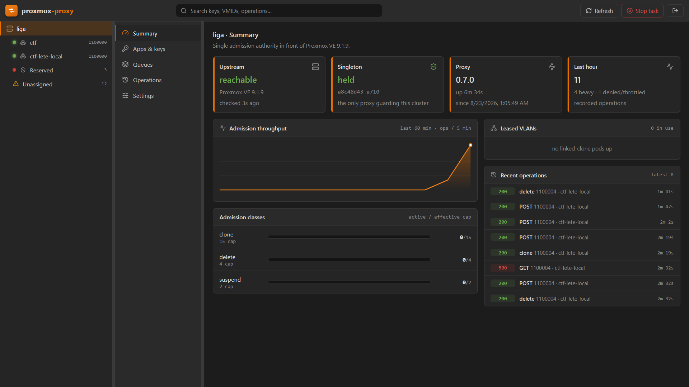

# proxmox-proxy

[](https://github.com/DLT-Code/proxmox-proxy/actions/workflows/ci.yml) [](https://github.com/DLT-Code/proxmox-proxy/actions/workflows/release-please.yml) [](https://github.com/DLT-Code/proxmox-proxy/actions/workflows/publish.yml)



**proxmox-proxy** es un punto de entrada único y neutral para varias aplicaciones que comparten
un mismo cluster de Proxmox VE. En lugar de que cada aplicación hable directamente con Proxmox con
credenciales de administrador, todas hablan con el proxy: él sostiene una sola cuenta de servicio
contra el cluster, da a cada aplicación una clave propia, limita lo que cada una puede ver y tocar
a sus rangos de VMID, y encola las operaciones pesadas para que ninguna aplicación pueda acaparar
la I/O del cluster ni pisar a las demás.

Es completamente agnóstico del dominio de sus consumidores: no sabe qué es un reto, un usuario o
una reserva. Solo conoce claves, rangos de VMID y tráfico de la API de Proxmox. Cualquier SDK o
cliente estándar de Proxmox funciona contra él sin cambiar una línea, porque habla la API de
Proxmox tal cual.

Este README sirve tanto al **operador** que lo despliega y lo administra como al **desarrollador**
de una aplicación que quiere consumirlo. Si vienes a integrar una aplicación, salta directamente a
[Guía para aplicaciones](#guía-para-aplicaciones): es el contrato completo.

## Cómo funciona

El proxy corre como un solo proceso que expone **un único puerto** y multiplexa dos planos por el
path de la petición. No necesita un proxy inverso delante para separarlos. Escucha en
`DEPLOY_HOST:DEPLOY_PORT` (por defecto solo en loopback, `127.0.0.1:8000`); el TLS, el dominio y la
VPN son responsabilidad del perímetro que pongas por delante.

```
aplicaciones ─(paths /api2/*, /proxy/*)─> proxy :8000   plano de datos (API de Proxmox)
operador ─────(resto de paths)──────────> proxy :8000   plano de gestión (panel + API admin)
proxy ─────────https──> pveproxy :8006                  una sola cuenta de servicio
aplicaciones ──wss───> pveproxy :8006                   solo websockets VNC, directos por diseño
```

- **Plano de datos** (`/api2/...`): reenvía la API de Proxmox. Las operaciones ligeras fluyen en
  streaming sin retención. Las pesadas (clonar, borrar, suspender) pasan por control de admisión, y
  su slot se retiene hasta que **la tarea de Proxmox termina**, no hasta que responde el HTTP,
  porque el coste real para el cluster es la tarea, no la petición.
- **Plano nativo** (`/proxy/...`): endpoints propios del proxy para descubrimiento (`whoami`),
  salud (`health`), consolas (`console-session`) y grupos de clones enlazados (`linked-clone`). Una
  aplicación descubre aquí todo lo que necesita sin configuración adicional.
- **Plano de gestión** (`/api/...` y el panel web en la raíz): claves, colas en vivo, historial de
  operaciones, inventario y ajustes. La API está tipada y publica su OpenAPI en `/api/openapi.json`.
- **Singleton por cluster**: solo puede existir un proxy activo por cluster. El cerrojo es un
  marcador con latido en el comentario de un pool reservado de Proxmox; una segunda instancia se
  niega a arrancar mientras el marcador esté fresco, y toma el relevo si el anterior caduca.
- **Estado mínimo**: SQLite guarda las claves emitidas, los ajustes y un anillo acotado de
  operaciones. Las colas viven en memoria; tras un reinicio, el estado real se reconstruye
  consultando al propio cluster.

La configuración vive en dos niveles. El `.env` solo lleva lo de arranque (upstream, credenciales,
red, singleton). Todo lo operable en caliente (caps de admisión, colas, TTL de sesión, rango de
VLAN, tamaño del historial) se gestiona desde el panel, se persiste en SQLite y se aplica sin
reiniciar.

## Puesta en marcha

El proxy se despliega desde una imagen ya publicada en `ghcr.io/dlt-code/proxmox-proxy`. No hace
falta el código fuente en el host: solo el `compose.yml` y un `.env`, ambos adjuntos a cada release.

```bash
gh release download -R DLT-Code/proxmox-proxy -p compose.yml -p env.example
cp env.example .env          # rellena las 2 variables obligatorias (upstream y token de servicio)
docker login ghcr.io         # la imagen es privada: usa un token con read:packages
docker compose up -d
docker compose logs proxy    # en el primer arranque imprime la contraseña del panel UNA sola vez
```

Para actualizar a la última versión publicada:

```bash
docker compose pull && docker compose up -d
```

`PROXY_IMAGE_TAG` en el `.env` fija una versión concreta (por ejemplo `PROXY_IMAGE_TAG=0.5.2`) en
lugar de seguir el `latest` móvil. El resto se autogenera y persiste (contraseña del panel, secreto
de sesión) o tiene un valor por defecto razonable. La contraseña del panel puede fijarse con
`ADMIN_PASSWORD` o, mejor, con `ADMIN_PASSWORD_HASH` (genera el hash con
`npm run hash-password -- 'tu-contraseña'`).

El panel vive en la raíz del mismo puerto que el plano de datos. Una vez dentro, se administran las
claves, se ven las colas y el inventario en vivo, y se ajusta todo el runtime.

### Requisitos en el cluster

La cuenta de servicio que el proxy usa contra Proxmox necesita: `VM.*` sobre las VMs que va a
custodiar, `Sys.Audit`, y `Pool.Allocate` sobre `/pool` (el cerrojo del singleton vive en un pool).

Una vez desplegado el proxy, cierra por firewall el acceso a `pveproxy:8006` a todo lo que no sea el
host del proxy y tu red de administración. Deja abierto el camino directo de los websockets VNC
desde los clientes a los nodos: las consolas no pasan por el proxy (ver
[Consola VNC](#consola-vnc)), así que un reinicio del proxy nunca corta una consola abierta.

## Claves de API

Las claves tienen el formato estándar de token de Proxmox, así que los clientes existentes las
envían sin tocar código:

```
PVEAPIToken=svc-proxy@pve!nombre-de-la-app=secreto
```

Se crean, rotan y revocan desde el panel (o la API de administración). El secreto se guarda hasheado
y se muestra una sola vez, en el momento de crearlo. La rotación admite una ventana de gracia
durante la cual el secreto anterior sigue siendo válido, para migrar sin corte. Cada clave lleva sus
rangos de VMID: todo lo que quede fuera se rechaza.

---

# Guía para aplicaciones

Esta sección es el **contrato** entre el proxy y cualquier aplicación que lo consuma: qué ve, qué
puede y qué no puede hacer, cómo se conecta y qué comportamientos debe esperar. Si estás integrando
una aplicación para que hable con el cluster **solo** a través del proxy, esto es todo lo que
necesitas.

## Conexión: dos variables y `whoami`

Una aplicación necesita exactamente dos datos de conexión:

```
PROXMOX_PROXY_ENDPOINT = https://<host-del-proxy>
PROXMOX_PROXY_KEY      = PVEAPIToken=svc-proxy@pve!mi-app=<secreto>
```

La clave se manda en la cabecera `Authorization` tal cual, así que cualquier SDK de Proxmox la
acepta sin cambios: basta apuntar el cliente a `PROXMOX_PROXY_ENDPOINT` en lugar de a
`pveproxy:8006`.

Todo lo demás se descubre en el arranque con una llamada:

```
GET /proxy/whoami
Authorization: <PROXMOX_PROXY_KEY>

200 OK
{
  "name": "mi-app",
  "vmidRanges": [[1100000, 1100999]],
  "websocketBase": "https://nodo.cluster:8006",
  "admission": { "clone": 15, "delete": 4, "suspend": 2 },
  "linkedVlanRange": [1000, 1149],          // null si la clonación enlazada está desactivada
  "features": { "consoleSession": true, "linkedClone": true, "proxyAssignsNewid": true }
}
```

La aplicación **no** deriva sus rangos de ninguna convención propia: el rango efectivo es
`vmidRanges` tal como lo devuelve `whoami`, y nada más.

## Qué ve una aplicación: opacidad total

El proxy es **opaco** respecto a todo lo que no pertenezca a la clave. Una aplicación nunca ve una
VM, plantilla o tarea de otra: las lecturas de lista se recortan a sus rangos antes de devolverse.

| Lectura                                           | Qué devuelve a través del proxy                                                                                          |
| ------------------------------------------------- | ------------------------------------------------------------------------------------------------------------------------ |
| `GET /api2/json/cluster/resources`                | Solo las VMs cuyo VMID cae en los rangos de la clave, más las filas de infraestructura sin VMID (nodos, almacenamiento). |
| `GET /api2/json/nodes/{node}/qemu` y `.../lxc`    | Solo los guests en rango.                                                                                                |
| `GET /api2/json/nodes/{node}/tasks`               | Solo las tareas cuyo VMID está en rango.                                                                                 |
| `GET /api2/json/nodes/{node}/storage/{s}/content` | Solo los volúmenes de VMs en rango (más ISOs y plantillas compartidas).                                                  |
| `GET .../qemu/{vmid}/...` (lectura concreta)      | 200 si el VMID está en rango; 403 si está fuera.                                                                         |

En consecuencia, una aplicación **no debe intentar descubrir ni contabilizar recursos ajenos**: no
los verá. Todo lo suyo (sus VMs, sus plantillas, sus tareas) lo ve ya recortado a lo suyo.

## Qué puede hacer una aplicación

Las operaciones normales de ciclo de vida funcionan tal cual, siempre con el VMID en el path y
dentro de su rango: `status/start|stop|suspend|resume|reset|shutdown`, `config` (GET y PUT),
`status/current`, `DELETE`, snapshots, etc. Las pesadas pasan por admisión (ver
[Códigos y admisión](#códigos-y-admisión)).

Además, hay operaciones con contrato propio.

### Clonar una VM: el proxy asigna el VMID

La aplicación **no elige el VMID nuevo**. Manda el clone **sin** `newid`; el proxy elige el id libre
más bajo dentro del rango de la clave (evitando VMs y plantillas existentes, y reservas en vuelo) y
lo inyecta:

```
POST /api2/json/nodes/{node}/qemu/{plantilla}/clone
Content-Type: application/x-www-form-urlencoded

full=0&name=reto-abc          # SIN newid

200 OK
X-Proxy-Newid: 1100137
{ "data": "UPID:nodo:...:qmclone:<plantilla>:root@pam:" }
```

El VMID creado se lee de la cabecera de respuesta **`X-Proxy-Newid`** (en el ejemplo, `1100137`).
Importante: **no** lo saques del UPID. El `id` del UPID de `qmclone` es el VMID **origen** (la
plantilla), no el del clon creado; la cabecera es la única fuente fiable. El cuerpo sigue trayendo
el UPID para seguir la tarea. La app debe crear su registro interno **después** de recibir la
respuesta. Si aun así manda un `newid`, debe estar en rango o se rechaza (y la cabecera lo eco);
si el rango de la clave está agotado, el proxy responde 507.

### Grupos de clones enlazados

La operación más común entre plataformas: levantar un **pod** de 2 o más máquinas que se comunican
entre sí de forma aislada. El proxy lo hace en una sola llamada: clona todas las plantillas como
clones enlazados, les asigna un VLAN libre del rango configurado, reescribe el `net0` de cada una
con ese tag, y devuelve el grupo ya montado.

```
POST /proxy/linked-clone
Content-Type: application/json

{
  "node": "liga",
  "clones": [
    { "template": 1100001, "name": "atacante" },
    { "template": 1100002, "name": "defensor" }
  ]
  // "vlan": 1050    // opcional: forzar un tag concreto (libre y en rango); omítelo para autoasignar
}

200 OK
{
  "vlan": 1050,
  "clones": [
    { "template": 1100001, "vmid": 1100140, "upid": "UPID:...:qmclone:1100140:..." },
    { "template": 1100002, "vmid": 1100141, "upid": "UPID:...:qmclone:1100141:..." }
  ]
}
```

Cada plantilla debe estar en el rango de la clave y ser realmente una plantilla. La operación es
**atómica**: si falla a mitad, el proxy borra los clones ya creados y libera el VLAN. Cada clon
consume un slot de admisión de la clase `clone`, así que la llamada es síncrona y puede tardar
varios segundos por clon. Guarda el `vlan` devuelto: es el **identificador del grupo**.

### El grupo es la unidad de operación

Una vez creado, el pod se opera **entero, con una sola instrucción**, direccionándolo por su VLAN.
No hay que recorrer las máquinas una a una.

```
# Encender / apagar / suspender... todo el grupo de golpe:
POST /proxy/linked-clone/{vlan}/start        # también reanuda un pod suspendido a disco
POST /proxy/linked-clone/{vlan}/stop
POST /proxy/linked-clone/{vlan}/shutdown
POST /proxy/linked-clone/{vlan}/reset
POST /proxy/linked-clone/{vlan}/suspend      # a disco; libera memoria del nodo

200 OK
{ "vlan": 1050, "node": "liga", "action": "stop",
  "members": [ { "vmid": 1100140, "ok": true, "upid": "..." },
               { "vmid": 1100141, "ok": true, "upid": "..." } ] }
```

```
# Destruir el pod completo y liberar su VLAN, en una sola llamada:
DELETE /proxy/linked-clone/{vlan}

200 OK
{ "vlan": 1050, "destroyed": [1100140, 1100141] }
```

El destroy es **idempotente**: una máquina que ya no exista cuenta como hecha. El VLAN se libera solo
cuando el pod entero está confirmado como destruido; si alguna máquina no se pudo borrar, el grupo se
conserva para que una reintento termine el trabajo. La suspensión de grupo pasa por admisión de la
clase `suspend`, como cualquier suspensión.

No necesitas liberar el VLAN a mano: al destruir el grupo se libera de inmediato, y aunque una
aplicación borrara las máquinas por su cuenta, el proxy detecta que el pod ya no existe y libera el
VLAN por su cuenta.

### Consola VNC

```
POST /proxy/console-session
{ "node": "liga", "vmid": 1100140 }

200 OK
{ "port": "5901", "ticket": "...", "cookie": "...", "expiresAt": 1735000000000,
  "websocketBase": "https://nodo:8006" }
```

`expiresAt` (epoch en ms) marca hasta cuándo es fiable la cookie del VNC: pasado ese momento, la
aplicación debe pedir una sesión nueva. El proxy acuña las credenciales del websocket VNC con una
identidad dedicada que solo tiene `VM.Console`. La aplicación abre el websocket **directo contra el nodo** (`websocketBase`), no contra
el proxy: el stream nunca cruza el proxy, y por eso un reinicio de este no corta consolas. El VMID
debe estar en rango.

## Qué NO puede hacer una aplicación

- **Gestionar identidad** (`/access/...`): 403 siempre. Usuarios, roles, tokens y permisos los
  gestiona el proxy; no se tocan a través de él. Lo mismo aplica a `pools` y a `cluster/nextid`.
- **Salirse de su rango**: cualquier operación sobre un VMID fuera de `vmidRanges` se rechaza con
  403, sea lectura o escritura.
- **Ver algo de fuera**: las listas vienen filtradas. No hay forma de enumerar recursos ajenos.
- **Tocar plantillas**: una plantilla es de **solo lectura**. Se puede leer y clonar desde ella,
  pero cualquier escritura o DELETE sobre una plantilla (incluida como destino de un `move_disk` o
  `move_volume`) devuelve 403. **Las plantillas no se borran nunca.**
- **Elegir su propio VMID o VLAN**: los asigna el proxy.
- **Abrir websockets contra el proxy**: responde 501. El VNC va directo al nodo.

## Códigos y admisión

Las operaciones pesadas (clone, delete, suspend) pasan por control de admisión. El slot se retiene
hasta que la **tarea** de Proxmox termina, no hasta que responde el HTTP.

**Guardia de streams.** La calidad de una consola en directo manda sobre el trabajo de fondo:
mientras un nodo tenga consolas abiertas (tareas `vncproxy` en ejecución, que el proxy observa en el
mismo sondeo de tareas del cluster que usa para el descuento out-of-band), las operaciones pesadas
sobre ese nodo se ejecutan **de una en una** y con un espaciado mínimo entre arranques
(`streamPacingMs`). Sin consolas abiertas no hay ventana que proteger y rigen los caps normales sin
recorte. La guardia cubre también consolas abiertas sin pasar por el proxy (la UI de Proxmox, otras
plataformas), nunca deniega (solo serializa y espacia) y se desactiva desde Settings
(`streamProtect`).

| Código | Significado                                                                                        | Qué debe hacer la aplicación                                 |
| ------ | -------------------------------------------------------------------------------------------------- | ------------------------------------------------------------ |
| `200`  | OK. En operaciones pesadas, el cuerpo trae el UPID de la tarea.                                    | Seguir la tarea por su UPID si necesita el resultado.        |
| `403`  | Fuera de rango, plantilla protegida, o endpoint de identidad.                                      | No reintentar: es un límite duro.                            |
| `429`  | Cola llena o sin slot dentro del presupuesto de espera. Trae `Retry-After`.                        | Reintentar tras `Retry-After`.                               |
| `503`  | Admisión no disponible, o el proxy no es ahora mismo la autoridad del cluster. Trae `Retry-After`. | Reintentar tras `Retry-After`.                               |
| `507`  | Rango de VMID de la clave agotado.                                                                 | Sin ids libres: es un problema de capacidad o configuración. |
| `502`  | El cluster falló aguas arriba.                                                                     | Reintentar con backoff.                                      |

Regla general: 429 y 503 son **transitorios con reintento** (respeta `Retry-After`); 403 y 507 son
**definitivos**.

---

## Configuración del sistema (operador)

Reglas que el operador debe respetar al configurar el proxy para una aplicación:

- **El rango de la clave contiene plantillas y clones.** El proxy autoriza un clone por el VMID de
  la plantilla origen, así que las plantillas de una aplicación y el espacio para sus clones viven
  siempre dentro del mismo rango asignado a esa aplicación.
- **Los reservados son configuración, no bloqueo por operación.** Los rangos o VMIDs reservados
  (en Settings) son una restricción de configuración: el proxy no permite crear una clave cuyo rango
  solape un reservado, ni añadir un reservado que solape el rango de una clave existente. El propio
  alcance de cada clave ya impide operar fuera; los reservados se ven en el inventario. Dos claves
  **sí** pueden solapar rangos entre sí (la misma aplicación lógica desde varios entornos, por
  ejemplo producción y desarrollo local, comparte un rango del cluster): el asignador reparte desde
  la ocupación real, así que nunca se duplica un VMID, y las aplicaciones solapadas se ven las VMs
  de la banda común (la opacidad es por rango).
- **El rango de VLAN de clonación enlazada** (`linkedVlanRange` en Settings) es el pool de tags
  802.1q del que el proxy arrienda un VLAN por grupo. Debe **no colisionar** con los tags que ya
  llevan por defecto las VMs. Vacío significa clonación enlazada desactivada.
- **Los caps de admisión** (clone, delete, suspend) y los parámetros de cola se ajustan en caliente
  desde Settings, sin reiniciar.

## Copia de seguridad y migración de host

Todo el estado duradero del proxy vive en un único fichero SQLite, y el panel lo expone entero:

- **Descargar** (Settings, «Download backup», o `GET /api/backup` con sesión de panel): un snapshot
  consistente tomado en caliente, sin parar el servicio. Incluye las claves de las aplicaciones
  (con sus hashes; los tokens en claro no se guardan nunca), los settings, el historial de
  operaciones, los arriendos de VLAN y los secretos del panel (el secreto de sesión y, si se
  autogeneró, el hash de la contraseña de administración).
- **Restaurar** (Settings, «Restore from file», o `POST /api/restore`): **sobreescritura completa**.
  El fichero se valida, se deja preparado junto a la base de datos y se aplica de forma atómica en
  el siguiente arranque; el proxy se reinicia solo (el `restart: unless-stopped` del compose lo
  levanta). Un fallo a mitad nunca deja un estado a medias: hasta el intercambio del arranque, la
  base anterior sigue intacta.

Para **migrar de host**: desplegar el compose en el destino con su propio `.env` (la configuración
de arranque, upstream, token de servicio, identidad de consola y bind, viaja en el entorno, no en
la copia), restaurar el backup desde el panel del destino y listo. Dos notas: las sesiones del
panel se invalidan (los secretos restaurados sustituyen a los del destino; la contraseña pasa a
ser la del origen salvo que el `.env` la fije), y los arriendos de VLAN de pods que ya no existan
en el cluster los libera el recolector con sus salvaguardas de siempre. Restaura siempre sobre una
versión del proxy igual o más nueva que la que produjo la copia.

Dos piezas más completan la recuperación de desastres:

- **Snapshots automáticos rotatorios** (Settings, «Auto backup every» y «Auto backups kept»): un
  snapshot cada N horas en `/data/backups/`, conservando los últimos K (por defecto cada 24 h,
  7 copias; 0 desactiva). Viven en el mismo volumen que la base, así que protegen contra
  corrupción y errores de operación, no contra la pérdida del host.
- **Token de extracción** (Settings, «Generate pull token»): autoriza únicamente la descarga del
  backup con una cabecera, sin flujo de login, para que un cron externo se lleve la copia fuera
  del host. Se muestra una sola vez (solo se guarda su hash) y se revoca desde el mismo sitio.

  ```sh
  curl -sf -H "X-Backup-Token: pbt_..." https://<proxy>/api/backup -o proxy-backup.db
  ```

## Migración desde acceso directo al cluster

Una aplicación que hoy habla directamente con Proxmox y pasa a consumir el proxy debe **quitar** lo
que queda obsoleto:

- Cualquier derivación de rangos por convención propia: el rango lo da `whoami`.
- Su propio asignador de VMID y el escaneo del cluster para elegir un id libre: lo asigna el proxy y
  se lee de la cabecera `X-Proxy-Newid` de la respuesta del clone.
- El bootstrap de acceso (crear usuario de servicio, roles, ACLs, pools; emitir o rotar tokens) y
  las credenciales de administrador: el proxy ya trae una clave preaprovisionada.
- La deduplicación de VLAN leyendo configuraciones ajenas: el proxy asigna y libera los VLAN de los
  grupos, y bajo opacidad una aplicación ya no puede leer configuraciones de máquinas ajenas.
- Cualquier lógica propia de protección de plantillas o de rangos reservados: la impone el proxy.

Y debe **conservar o ajustar**:

- Leer la cabecera `X-Proxy-Newid` de la respuesta del clone para conocer el VMID creado, y guardar
  su registro interno después.
- Usar `POST /proxy/linked-clone` para levantar pods, y operar cada pod por su VLAN (encender,
  apagar, suspender y destruir el grupo entero de una vez) en lugar de recorrer las máquinas.
- Tratar los códigos de arriba (reintento en 429 y 503).
- Abrir el VNC directo al nodo con lo que devuelve `/proxy/console-session`.

---

## Desarrollo

```bash
npm install && npm install --prefix panel
npm run dev                      # proxy con recarga (tsx watch), edge en :8000
npm run dev --prefix panel       # panel Vite, con proxy de /api hacia :8000
npm test                         # unit + e2e contra un pveproxy simulado
npm run openapi                  # regenera panel/openapi.json y los tipos del cliente del panel
```

`SINGLETON_DISABLED=true` permite desarrollar sin cluster. La suite e2e levanta el proxy completo
contra un Proxmox simulado y cubre autenticación, alcance por rangos, opacidad, admisión,
seguimiento de tareas, clonación enlazada y operaciones de grupo.

Cada variable de entorno está documentada en [.env.example](.env.example).
